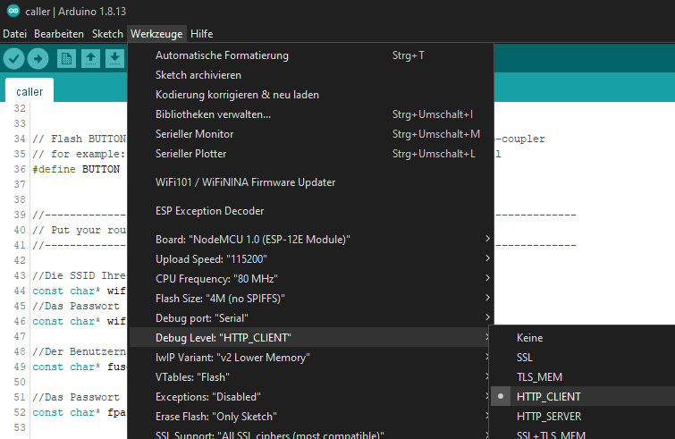

# Arduino-TR-064-SOAP-Library 
## Information for Debuging 

Different debug level

`DEBUG_NONE`         Print no debug messages whatsoever  
`DEBUG_ERROR`        Only print error messages  
`DEBUG_WARNING`      Only print error and warning messages  
`DEBUG_INFO`         Print error, warning and info messages  
`DEBUG_VERBOSE`      Print all messages  

To change the Level add following line to your code before the init call.

connection.debug_level = connection.DEBUG_VERBOSE;
connection.init();

## HTTP_Client Debug

very Usefull to see the actual HTTP Call/Responce handling.

https://github.com/esp8266/Arduino/blob/master/doc/Troubleshooting/debugging.rst

## Wireshark for deep looking.

### with Fritzbox generating the Trace

https://www.it-techblog.de/fritzbox-und-wireshark-wlan-router-von-avm-monitoren-teil-1/11/2017/